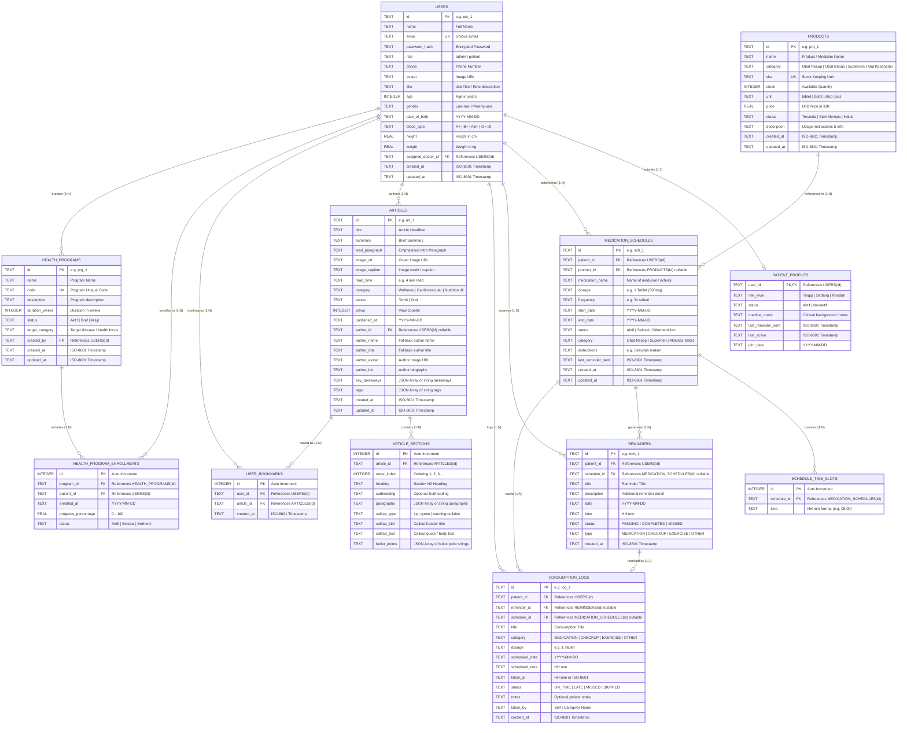

# Entity Relationship Diagram (ERD) & Database Specification

Dokumentasi rancangan database relasional untuk aplikasi Tablet Kesehatan menggunakan **PostgreSQL (Neon Database)** dengan driver resmi **`pg` (`node-postgres`)** tanpa ORM.

## 1. Visual ER Diagram (Mermaid)



---

## 2. Kamus Data & Spesifikasi Tabel (Data Dictionary)

### 2.1. Tabel `users`
Menyimpan seluruh data identitas akun pengguna (baik pasien maupun admin/dokter).

| Kolom | Tipe Data SQLite | Constraint | Deskripsi |
| :--- | :--- | :--- | :--- |
| `id` | `TEXT` | `PRIMARY KEY` | ID unik akun (misal: `usr_admin_1`, `usr_patient_1`) |
| `name` | `TEXT` | `NOT NULL` | Nama lengkap pengguna |
| `email` | `TEXT` | `NOT NULL UNIQUE` | Alamat email untuk login & notifikasi |
| `password_hash` | `TEXT` | `NULL` | Hash password (opsional pada mode mockup) |
| `role` | `TEXT` | `NOT NULL CHECK(role IN ('admin', 'patient'))` | Peran hak akses |
| `phone` | `TEXT` | `NULL` | Nomor kontak |
| `avatar` | `TEXT` | `NULL` | URL gambar profil |
| `title` | `TEXT` | `NULL` | Gelar/spesialisasi dokter (khusus admin) |
| `age` | `INTEGER` | `NULL` | Usia |
| `gender` | `TEXT` | `NULL CHECK(gender IN ('Laki-laki', 'Perempuan'))` | Jenis kelamin |
| `date_of_birth` | `TEXT` | `NULL` | Tanggal lahir (format `YYYY-MM-DD`) |
| `blood_type` | `TEXT` | `NULL` | Golongan darah (`A`, `B`, `AB`, `O`, dll.) |
| `height` | `REAL` | `NULL` | Tinggi badan (cm) |
| `weight` | `REAL` | `NULL` | Berat badan (kg) |
| `assigned_doctor_id`| `TEXT` | `NULL REFERENCES users(id) ON DELETE SET NULL` | ID dokter pembina (untuk pasien) |
| `created_at` | `TEXT` | `NOT NULL DEFAULT CURRENT_TIMESTAMP` | Waktu dibuat |
| `updated_at` | `TEXT` | `NOT NULL DEFAULT CURRENT_TIMESTAMP` | Waktu terakhir diubah |

---

### 2.2. Tabel `patient_profiles`
Ekstensi informasi klinis dan status kepatuhan khusus untuk user bertipe `patient`.

| Kolom | Tipe Data SQLite | Constraint | Deskripsi |
| :--- | :--- | :--- | :--- |
| `user_id` | `TEXT` | `PRIMARY KEY REFERENCES users(id) ON DELETE CASCADE` | Relasi 1:1 ke tabel `users` |
| `risk_level` | `TEXT` | `NOT NULL DEFAULT 'Rendah' CHECK(risk_level IN ('Tinggi', 'Sedang', 'Rendah'))` | Tingkat risiko klinis |
| `status` | `TEXT` | `NOT NULL DEFAULT 'Aktif' CHECK(status IN ('Aktif', 'Nonaktif'))` | Status keaktifan pasien |
| `medical_notes` | `TEXT` | `NULL` | Catatan riwayat medis/alergi |
| `last_reminder_sent` | `TEXT` | `NULL` | Waktu terakhir pengiriman reminder |
| `last_active` | `TEXT` | `NULL` | Waktu terakhir pasien membuka aplikasi |
| `join_date` | `TEXT` | `NOT NULL DEFAULT (date('now'))` | Tanggal bergabung |

---

### 2.3. Tabel `products`
Master data obat, suplemen, dan alat kesehatan pada sistem.

| Kolom | Tipe Data SQLite | Constraint | Deskripsi |
| :--- | :--- | :--- | :--- |
| `id` | `TEXT` | `PRIMARY KEY` | ID unik produk (misal: `prd_1`) |
| `name` | `TEXT` | `NOT NULL` | Nama obat / suplemen |
| `category` | `TEXT` | `NOT NULL CHECK(category IN ('Obat Resep', 'Obat Bebas', 'Suplemen', 'Alat Kesehatan'))` | Kategori produk |
| `sku` | `TEXT` | `NOT NULL UNIQUE` | Kode SKU stok inventaris |
| `stock` | `INTEGER` | `NOT NULL DEFAULT 0` | Jumlah stok tersisa |
| `unit` | `TEXT` | `NOT NULL` | Satuan dosis/kemasan (tablet, botol, strip, dll.) |
| `price` | `REAL` | `NOT NULL DEFAULT 0.0` | Harga satuan dalam IDR |
| `status` | `TEXT` | `NOT NULL CHECK(status IN ('Tersedia', 'Stok Menipis', 'Habis'))` | Indikator ketersediaan |
| `description` | `TEXT` | `NULL` | Penjelasan obat, fungsi & aturan |
| `created_at` | `TEXT` | `NOT NULL DEFAULT CURRENT_TIMESTAMP` | Waktu dibuat |
| `updated_at` | `TEXT` | `NOT NULL DEFAULT CURRENT_TIMESTAMP` | Waktu pembaruan |

---

### 2.4. Tabel `medication_schedules`
Rencana jadwal pengobatan pasien jangka panjang yang ditetapkan oleh dokter atau pasien sendiri.

| Kolom | Tipe Data SQLite | Constraint | Deskripsi |
| :--- | :--- | :--- | :--- |
| `id` | `TEXT` | `PRIMARY KEY` | ID jadwal (misal: `sch_1`) |
| `patient_id` | `TEXT` | `NOT NULL REFERENCES users(id) ON DELETE CASCADE` | Pasien pemilik jadwal |
| `product_id` | `TEXT` | `NULL REFERENCES products(id) ON DELETE SET NULL` | Obat terkait dari katalog |
| `medication_name` | `TEXT` | `NOT NULL` | Nama obat/tindakan medis |
| `dosage` | `TEXT` | `NOT NULL` | Dosis (misal: `1 Tablet (500mg)`) |
| `frequency` | `TEXT` | `NOT NULL` | Frekuensi (misal: `3x sehari`) |
| `start_date` | `TEXT` | `NOT NULL` | Tanggal mulai (`YYYY-MM-DD`) |
| `end_date` | `TEXT` | `NOT NULL` | Tanggal selesai (`YYYY-MM-DD`) |
| `status` | `TEXT` | `NOT NULL CHECK(status IN ('Aktif', 'Selesai', 'Diberhentikan'))` | Status jadwal |
| `category` | `TEXT` | `NOT NULL CHECK(category IN ('Obat Resep', 'Suplemen', 'Aktivitas Medis'))` | Klasifikasi jadwal |
| `instructions` | `TEXT` | `NULL` | Petunjuk minum (misal: *Sesudah makan*) |
| `last_reminder_sent` | `TEXT` | `NULL` | Waktu pengiriman notifikasi terakhir |
| `created_at` | `TEXT` | `NOT NULL DEFAULT CURRENT_TIMESTAMP` | Waktu dibuat |
| `updated_at` | `TEXT` | `NOT NULL DEFAULT CURRENT_TIMESTAMP` | Waktu pembaruan |

---

### 2.5. Tabel `schedule_time_slots`
Slot jam spesifik untuk setiap jadwal pengobatan (relasi 1:N ke `medication_schedules`).

| Kolom | Tipe Data SQLite | Constraint | Deskripsi |
| :--- | :--- | :--- | :--- |
| `id` | `INTEGER` | `PRIMARY KEY AUTOINCREMENT` | Auto increment ID |
| `schedule_id` | `TEXT` | `NOT NULL REFERENCES medication_schedules(id) ON DELETE CASCADE` | ID jadwal induk |
| `time` | `TEXT` | `NOT NULL` | Format jam `HH:mm` (misal: `08:00`, `13:00`, `20:00`) |

---

### 2.6. Tabel `reminders`
Notifikasi harian spesifik yang muncul pada tablet pasien.

| Kolom | Tipe Data SQLite | Constraint | Deskripsi |
| :--- | :--- | :--- | :--- |
| `id` | `TEXT` | `PRIMARY KEY` | ID unik pengingat (misal: `rem_1`) |
| `patient_id` | `TEXT` | `NOT NULL REFERENCES users(id) ON DELETE CASCADE` | Pasien penerima pengingat |
| `schedule_id` | `TEXT` | `NULL REFERENCES medication_schedules(id) ON DELETE SET NULL` | Relasi ke jadwal induk jika ada |
| `title` | `TEXT` | `NOT NULL` | Judul pengingat |
| `description` | `TEXT` | `NULL` | Keterangan dosis atau instruksi singkat |
| `date` | `TEXT` | `NOT NULL` | Tanggal eksekusi (`YYYY-MM-DD`) |
| `time` | `TEXT` | `NOT NULL` | Jam eksekusi (`HH:mm`) |
| `status` | `TEXT` | `NOT NULL DEFAULT 'PENDING' CHECK(status IN ('PENDING', 'COMPLETED', 'MISSED'))` | Status eksekusi |
| `type` | `TEXT` | `NOT NULL CHECK(type IN ('MEDICATION', 'CHECKUP', 'EXERCISE', 'OTHER'))` | Kategori kegiatan |
| `created_at` | `TEXT` | `NOT NULL DEFAULT CURRENT_TIMESTAMP` | Waktu dibuat |

---

### 2.7. Tabel `consumption_logs`
Catatan riwayat konsumsi aktual pasien untuk perhitungan statistik kepatuhan (*Adherence Rate*).

| Kolom | Tipe Data SQLite | Constraint | Deskripsi |
| :--- | :--- | :--- | :--- |
| `id` | `TEXT` | `PRIMARY KEY` | ID log riwayat (misal: `log_1`) |
| `patient_id` | `TEXT` | `NOT NULL REFERENCES users(id) ON DELETE CASCADE` | Pasien yang bersangkutan |
| `reminder_id` | `TEXT` | `NULL REFERENCES reminders(id) ON DELETE SET NULL` | ID reminder terkait |
| `schedule_id` | `TEXT` | `NULL REFERENCES medication_schedules(id) ON DELETE SET NULL` | ID jadwal terkait |
| `title` | `TEXT` | `NOT NULL` | Judul obat/aktivitas |
| `category` | `TEXT` | `NOT NULL CHECK(category IN ('MEDICATION', 'CHECKUP', 'EXERCISE', 'OTHER'))` | Kategori |
| `dosage` | `TEXT` | `NULL` | Dosis yang diminum |
| `scheduled_date`| `TEXT` | `NOT NULL` | Tanggal seharusnya diminum (`YYYY-MM-DD`) |
| `scheduled_time`| `TEXT` | `NOT NULL` | Jam seharusnya diminum (`HH:mm`) |
| `taken_at` | `TEXT` | `NULL` | Waktu aktual konfirmasi diminum |
| `status` | `TEXT` | `NOT NULL CHECK(status IN ('ON_TIME', 'LATE', 'MISSED', 'SKIPPED'))` | Hasil kepatuhan |
| `notes` | `TEXT` | `NULL` | Catatan tambahan pasien |
| `taken_by` | `TEXT` | `NOT NULL DEFAULT 'Self'` | Pengambil obat (Self / Nama Caregiver) |
| `created_at` | `TEXT` | `NOT NULL DEFAULT CURRENT_TIMESTAMP` | Waktu pencatatan log |

---

### 2.8. Tabel `articles`
Master konten artikel edukasi kesehatan yang ditampilkan pada *Centered Content Sections*.

| Kolom | Tipe Data SQLite | Constraint | Deskripsi |
| :--- | :--- | :--- | :--- |
| `id` | `TEXT` | `PRIMARY KEY` | ID artikel (misal: `art_1`) |
| `title` | `TEXT` | `NOT NULL` | Judul artikel |
| `summary` | `TEXT` | `NOT NULL` | Ringkasan singkat |
| `lead_paragraph` | `TEXT` | `NULL` | Paragraf pembuka berukuran besar |
| `image_url` | `TEXT` | `NOT NULL` | URL cover gambar utama |
| `image_caption` | `TEXT` | `NULL` | Keterangan/kredit gambar |
| `read_time` | `TEXT` | `NOT NULL` | Estimasi baca (misal: `4 min read`) |
| `category` | `TEXT` | `NOT NULL` | Kategori (`Wellness`, `Cardiovascular`, `Nutrition`, dll.) |
| `status` | `TEXT` | `NOT NULL DEFAULT 'Terbit' CHECK(status IN ('Terbit', 'Draf'))` | Status publikasi |
| `views` | `INTEGER` | `NOT NULL DEFAULT 0` | Jumlah tayangan artikel |
| `published_at` | `TEXT` | `NOT NULL` | Tanggal rilis (`YYYY-MM-DD`) |
| `author_id` | `TEXT` | `NULL REFERENCES users(id) ON DELETE SET NULL` | Penulis terdaftar di sistem |
| `author_name` | `TEXT` | `NULL` | Nama penulis / reviewer medis |
| `author_role` | `TEXT` | `NULL` | Gelar / spesialisasi penulis |
| `author_avatar` | `TEXT` | `NULL` | Foto avatar penulis |
| `author_bio` | `TEXT` | `NULL` | Biografi singkat penulis |
| `key_takeaways` | `TEXT` | `NULL` | JSON string array dari poin penting |
| `tags` | `TEXT` | `NULL` | JSON string array dari tagar |
| `created_at` | `TEXT` | `NOT NULL DEFAULT CURRENT_TIMESTAMP` | Waktu dibuat |
| `updated_at` | `TEXT` | `NOT NULL DEFAULT CURRENT_TIMESTAMP` | Waktu pembaruan |

---

### 2.9. Tabel `article_sections`
Bagian konten terstruktur dari artikel (*Centered Section Body*).

| Kolom | Tipe Data SQLite | Constraint | Deskripsi |
| :--- | :--- | :--- | :--- |
| `id` | `INTEGER` | `PRIMARY KEY AUTOINCREMENT` | Auto increment ID |
| `article_id` | `TEXT` | `NOT NULL REFERENCES articles(id) ON DELETE CASCADE` | ID artikel induk |
| `order_index` | `INTEGER` | `NOT NULL DEFAULT 1` | Urutan tampil bagian (1, 2, 3, ...) |
| `heading` | `TEXT` | `NULL` | Subheading H2 |
| `subheading` | `TEXT` | `NULL` | Subheading H3 opsional |
| `paragraphs` | `TEXT` | `NOT NULL` | JSON string array dari paragraf-paragraf |
| `callout_type` | `TEXT` | `NULL CHECK(callout_type IN ('tip', 'quote', 'warning'))` | Tipe kotak highlight |
| `callout_title` | `TEXT` | `NULL` | Judul kotak highlight |
| `callout_text` | `TEXT` | `NULL` | Isi pesan highlight |
| `bullet_points` | `TEXT` | `NULL` | JSON string array dari poin-poin checklist |

---

### 2.10. Tabel `user_bookmarks`
Menyimpan artikel yang disimpan (bookmark) oleh pengguna.

| Kolom | Tipe Data SQLite | Constraint | Deskripsi |
| :--- | :--- | :--- | :--- |
| `id` | `INTEGER` | `PRIMARY KEY AUTOINCREMENT` | Auto increment ID |
| `user_id` | `TEXT` | `NOT NULL REFERENCES users(id) ON DELETE CASCADE` | Pengguna yang menyimpan |
| `article_id` | `TEXT` | `NOT NULL REFERENCES articles(id) ON DELETE CASCADE` | Artikel yang disimpan |
| `created_at` | `TEXT` | `NOT NULL DEFAULT CURRENT_TIMESTAMP` | Waktu disimpan |
| - | - | `UNIQUE(user_id, article_id)` | Mencegah bookmark ganda |

---

### 2.11. Tabel `health_programs`
Program kesehatan atau intervensi klinis (misal: *Program Kendali Hipertensi 8 Minggu*).

| Kolom | Tipe Data SQLite | Constraint | Deskripsi |
| :--- | :--- | :--- | :--- |
| `id` | `TEXT` | `PRIMARY KEY` | ID program (misal: `prg_1`) |
| `name` | `TEXT` | `NOT NULL` | Nama program kesehatan |
| `code` | `TEXT` | `NOT NULL UNIQUE` | Kode unik program |
| `description` | `TEXT` | `NULL` | Penjelasan tujuan & modul program |
| `duration_weeks`| `INTEGER`| `NOT NULL DEFAULT 4` | Durasi program dalam satuan minggu |
| `status` | `TEXT` | `NOT NULL DEFAULT 'Aktif' CHECK(status IN ('Aktif', 'Draf', 'Arsip'))` | Status program |
| `target_category`| `TEXT` | `NOT NULL` | Kategori penyakit sasaran |
| `created_by` | `TEXT` | `NULL REFERENCES users(id) ON DELETE SET NULL` | ID dokter pembuat |
| `created_at` | `TEXT` | `NOT NULL DEFAULT CURRENT_TIMESTAMP` | Waktu dibuat |
| `updated_at` | `TEXT` | `NOT NULL DEFAULT CURRENT_TIMESTAMP` | Waktu pembaruan |

---

### 2.12. Tabel `health_program_enrollments`
Pencatatan pasien yang terdaftar di dalam program kesehatan.

| Kolom | Tipe Data SQLite | Constraint | Deskripsi |
| :--- | :--- | :--- | :--- |
| `id` | `INTEGER` | `PRIMARY KEY AUTOINCREMENT` | Auto increment ID |
| `program_id` | `TEXT` | `NOT NULL REFERENCES health_programs(id) ON DELETE CASCADE` | ID program |
| `patient_id` | `TEXT` | `NOT NULL REFERENCES users(id) ON DELETE CASCADE` | ID pasien terdaftar |
| `enrolled_at` | `TEXT` | `NOT NULL DEFAULT (date('now'))` | Tanggal mulai ikut |
| `progress_percentage` | `REAL` | `NOT NULL DEFAULT 0.0` | Persentase progres (0-100%) |
| `status` | `TEXT` | `NOT NULL DEFAULT 'Aktif' CHECK(status IN ('Aktif', 'Selesai', 'Berhenti'))` | Status partisipasi |
| - | - | `UNIQUE(program_id, patient_id)` | Pasien hanya terdaftar 1x per program |

---

## 3. Skrip DDL Native SQLite (`schema.sql`)

Berikut adalah skrip SQL murni (*Native SQL*) lengkap dengan *Foreign Keys* dan *Index Performance*:

```sql
-- Aktifkan Foreign Keys constraint di SQLite
PRAGMA foreign_keys = ON;

-- ============================================================
-- 1. USERS & PATIENT PROFILES
-- ============================================================
CREATE TABLE IF NOT EXISTS users (
    id TEXT PRIMARY KEY,
    name TEXT NOT NULL,
    email TEXT NOT NULL UNIQUE,
    password_hash TEXT,
    role TEXT NOT NULL CHECK(role IN ('admin', 'patient')),
    phone TEXT,
    avatar TEXT,
    title TEXT,
    age INTEGER,
    gender TEXT CHECK(gender IN ('Laki-laki', 'Perempuan')),
    date_of_birth TEXT,
    blood_type TEXT,
    height REAL,
    weight REAL,
    assigned_doctor_id TEXT REFERENCES users(id) ON DELETE SET NULL,
    created_at TEXT NOT NULL DEFAULT CURRENT_TIMESTAMP,
    updated_at TEXT NOT NULL DEFAULT CURRENT_TIMESTAMP
);

CREATE TABLE IF NOT EXISTS patient_profiles (
    user_id TEXT PRIMARY KEY REFERENCES users(id) ON DELETE CASCADE,
    risk_level TEXT NOT NULL DEFAULT 'Rendah' CHECK(risk_level IN ('Tinggi', 'Sedang', 'Rendah')),
    status TEXT NOT NULL DEFAULT 'Aktif' CHECK(status IN ('Aktif', 'Nonaktif')),
    medical_notes TEXT,
    last_reminder_sent TEXT,
    last_active TEXT,
    join_date TEXT NOT NULL DEFAULT (date('now'))
);

-- ============================================================
-- 2. PRODUCTS (INVENTORY)
-- ============================================================
CREATE TABLE IF NOT EXISTS products (
    id TEXT PRIMARY KEY,
    name TEXT NOT NULL,
    category TEXT NOT NULL CHECK(category IN ('Obat Resep', 'Obat Bebas', 'Suplemen', 'Alat Kesehatan')),
    sku TEXT NOT NULL UNIQUE,
    stock INTEGER NOT NULL DEFAULT 0,
    unit TEXT NOT NULL,
    price REAL NOT NULL DEFAULT 0.0,
    status TEXT NOT NULL CHECK(status IN ('Tersedia', 'Stok Menipis', 'Habis')),
    description TEXT,
    created_at TEXT NOT NULL DEFAULT CURRENT_TIMESTAMP,
    updated_at TEXT NOT NULL DEFAULT CURRENT_TIMESTAMP
);

-- ============================================================
-- 3. MEDICATION SCHEDULES & TIME SLOTS
-- ============================================================
CREATE TABLE IF NOT EXISTS medication_schedules (
    id TEXT PRIMARY KEY,
    patient_id TEXT NOT NULL REFERENCES users(id) ON DELETE CASCADE,
    product_id TEXT REFERENCES products(id) ON DELETE SET NULL,
    medication_name TEXT NOT NULL,
    dosage TEXT NOT NULL,
    frequency TEXT NOT NULL,
    start_date TEXT NOT NULL,
    end_date TEXT NOT NULL,
    status TEXT NOT NULL CHECK(status IN ('Aktif', 'Selesai', 'Diberhentikan')),
    category TEXT NOT NULL CHECK(category IN ('Obat Resep', 'Suplemen', 'Aktivitas Medis')),
    instructions TEXT,
    last_reminder_sent TEXT,
    created_at TEXT NOT NULL DEFAULT CURRENT_TIMESTAMP,
    updated_at TEXT NOT NULL DEFAULT CURRENT_TIMESTAMP
);

CREATE TABLE IF NOT EXISTS schedule_time_slots (
    id INTEGER PRIMARY KEY AUTOINCREMENT,
    schedule_id TEXT NOT NULL REFERENCES medication_schedules(id) ON DELETE CASCADE,
    time TEXT NOT NULL
);

-- ============================================================
-- 4. REMINDERS & CONSUMPTION LOGS
-- ============================================================
CREATE TABLE IF NOT EXISTS reminders (
    id TEXT PRIMARY KEY,
    patient_id TEXT NOT NULL REFERENCES users(id) ON DELETE CASCADE,
    schedule_id TEXT REFERENCES medication_schedules(id) ON DELETE SET NULL,
    title TEXT NOT NULL,
    description TEXT,
    date TEXT NOT NULL,
    time TEXT NOT NULL,
    status TEXT NOT NULL DEFAULT 'PENDING' CHECK(status IN ('PENDING', 'COMPLETED', 'MISSED')),
    type TEXT NOT NULL CHECK(type IN ('MEDICATION', 'CHECKUP', 'EXERCISE', 'OTHER')),
    created_at TEXT NOT NULL DEFAULT CURRENT_TIMESTAMP
);

CREATE TABLE IF NOT EXISTS consumption_logs (
    id TEXT PRIMARY KEY,
    patient_id TEXT NOT NULL REFERENCES users(id) ON DELETE CASCADE,
    reminder_id TEXT REFERENCES reminders(id) ON DELETE SET NULL,
    schedule_id TEXT REFERENCES medication_schedules(id) ON DELETE SET NULL,
    title TEXT NOT NULL,
    category TEXT NOT NULL CHECK(category IN ('MEDICATION', 'CHECKUP', 'EXERCISE', 'OTHER')),
    dosage TEXT,
    scheduled_date TEXT NOT NULL,
    scheduled_time TEXT NOT NULL,
    taken_at TEXT,
    status TEXT NOT NULL CHECK(status IN ('ON_TIME', 'LATE', 'MISSED', 'SKIPPED')),
    notes TEXT,
    taken_by TEXT NOT NULL DEFAULT 'Self',
    created_at TEXT NOT NULL DEFAULT CURRENT_TIMESTAMP
);

-- ============================================================
-- 5. EDUCATION & ARTICLES
-- ============================================================
CREATE TABLE IF NOT EXISTS articles (
    id TEXT PRIMARY KEY,
    title TEXT NOT NULL,
    summary TEXT NOT NULL,
    lead_paragraph TEXT,
    image_url TEXT NOT NULL,
    image_caption TEXT,
    read_time TEXT NOT NULL,
    category TEXT NOT NULL,
    status TEXT NOT NULL DEFAULT 'Terbit' CHECK(status IN ('Terbit', 'Draf')),
    views INTEGER NOT NULL DEFAULT 0,
    published_at TEXT NOT NULL,
    author_id TEXT REFERENCES users(id) ON DELETE SET NULL,
    author_name TEXT,
    author_role TEXT,
    author_avatar TEXT,
    author_bio TEXT,
    key_takeaways TEXT, -- JSON Array
    tags TEXT,          -- JSON Array
    created_at TEXT NOT NULL DEFAULT CURRENT_TIMESTAMP,
    updated_at TEXT NOT NULL DEFAULT CURRENT_TIMESTAMP
);

CREATE TABLE IF NOT EXISTS article_sections (
    id INTEGER PRIMARY KEY AUTOINCREMENT,
    article_id TEXT NOT NULL REFERENCES articles(id) ON DELETE CASCADE,
    order_index INTEGER NOT NULL DEFAULT 1,
    heading TEXT,
    subheading TEXT,
    paragraphs TEXT NOT NULL, -- JSON Array
    callout_type TEXT CHECK(callout_type IN ('tip', 'quote', 'warning')),
    callout_title TEXT,
    callout_text TEXT,
    bullet_points TEXT        -- JSON Array
);

CREATE TABLE IF NOT EXISTS user_bookmarks (
    id INTEGER PRIMARY KEY AUTOINCREMENT,
    user_id TEXT NOT NULL REFERENCES users(id) ON DELETE CASCADE,
    article_id TEXT NOT NULL REFERENCES articles(id) ON DELETE CASCADE,
    created_at TEXT NOT NULL DEFAULT CURRENT_TIMESTAMP,
    UNIQUE(user_id, article_id)
);

-- ============================================================
-- 6. HEALTH PROGRAMS
-- ============================================================
CREATE TABLE IF NOT EXISTS health_programs (
    id TEXT PRIMARY KEY,
    name TEXT NOT NULL,
    code TEXT NOT NULL UNIQUE,
    description TEXT,
    duration_weeks INTEGER NOT NULL DEFAULT 4,
    status TEXT NOT NULL DEFAULT 'Aktif' CHECK(status IN ('Aktif', 'Draf', 'Arsip')),
    target_category TEXT NOT NULL,
    created_by TEXT REFERENCES users(id) ON DELETE SET NULL,
    created_at TEXT NOT NULL DEFAULT CURRENT_TIMESTAMP,
    updated_at TEXT NOT NULL DEFAULT CURRENT_TIMESTAMP
);

CREATE TABLE IF NOT EXISTS health_program_enrollments (
    id INTEGER PRIMARY KEY AUTOINCREMENT,
    program_id TEXT NOT NULL REFERENCES health_programs(id) ON DELETE CASCADE,
    patient_id TEXT NOT NULL REFERENCES users(id) ON DELETE CASCADE,
    enrolled_at TEXT NOT NULL DEFAULT (date('now')),
    progress_percentage REAL NOT NULL DEFAULT 0.0,
    status TEXT NOT NULL DEFAULT 'Aktif' CHECK(status IN ('Aktif', 'Selesai', 'Berhenti')),
    UNIQUE(program_id, patient_id)
);

-- ============================================================
-- 7. PERFORMANCE INDEXES
-- ============================================================
CREATE INDEX IF NOT EXISTS idx_users_email ON users(email);
CREATE INDEX IF NOT EXISTS idx_users_role ON users(role);
CREATE INDEX IF NOT EXISTS idx_schedules_patient ON medication_schedules(patient_id);
CREATE INDEX IF NOT EXISTS idx_reminders_patient_date ON reminders(patient_id, date);
CREATE INDEX IF NOT EXISTS idx_logs_patient_date ON consumption_logs(patient_id, scheduled_date);
CREATE INDEX IF NOT EXISTS idx_articles_category ON articles(category);
CREATE INDEX IF NOT EXISTS idx_article_sections_art_order ON article_sections(article_id, order_index);
CREATE INDEX IF NOT EXISTS idx_bookmarks_user ON user_bookmarks(user_id);
```

---

## 4. Pola Implementasi Native PostgreSQL Driver (`pg`) Tanpa ORM

Untuk menghubungkan Next.js dengan Neon PostgreSQL secara clean dan scalable sesuai arsitektur proyek:

```
src/
├── lib/
│   └── db/
│       ├── client.ts         # Inisialisasi koneksi pg.Pool singleton & helpers
│       ├── schema.sql        # Skrip DDL PostgreSQL
│       ├── init.ts           # Runner pembuatan tabel di Neon PostgreSQL
│       └── seed.ts           # Runner pengisian data mockup awal ke Neon
└── features/
    └── [feature]/
        └── api/
            └── [entity]Repository.ts  # Fungsi query SQL murni dengan parameter $1, $2 (async/await)
```

### Contoh Pola Query Native dengan `pg`:
```ts
import db from '@/src/lib/db/client'
import { Article } from '../types'

export async function findArticleById(id: string): Promise<Article | null> {
  const rowRes = await db.query('SELECT * FROM articles WHERE id = $1', [id])
  const row = rowRes.rows[0]
  if (!row) return null

  const sectionsRes = await db.query(
    'SELECT * FROM article_sections WHERE article_id = $1 ORDER BY order_index ASC',
    [id]
  )
  const sections = sectionsRes.rows

  return {
    ...row,
    keyTakeaways: row.key_takeaways ? JSON.parse(row.key_takeaways) : [],
    tags: row.tags ? JSON.parse(row.tags) : [],
    sections: sections.map(sec => ({
      heading: sec.heading,
      paragraphs: JSON.parse(sec.paragraphs),
      callout: sec.callout_text ? {
        type: sec.callout_type,
        title: sec.callout_title,
        text: sec.callout_text
      } : undefined,
      bulletPoints: sec.bullet_points ? JSON.parse(sec.bullet_points) : []
    }))
  }
}
```
